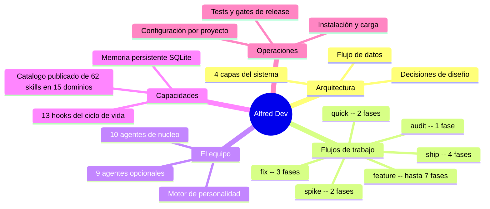

# Documentación técnica de Alfred Dev

Esta documentación esta pensada para desarrolladores que necesitan entender como funciona el plugin Alfred Dev por dentro: su arquitectura, sus decisiones de diseño, como se integra en Codex y como contribuir. No es documentación de usuario (eso esta en el [README del proyecto](../README.md) y en la [landing page](https://alfred-dev.com/)); es documentación técnica del plugin.

`docs/` contiene solo documentación estable y útil para entender, operar y mantener Alfred Dev. Los artefactos temporales de trabajo no se publican aquí; los informes de release versionados sí viven en este directorio cuando documentan evidencia útil para mantener el plugin.

La rama `main` contiene el plugin y su runtime. La landing publica vive en la rama `Alfred-Astro` y se despliega desde Coolify sobre el VPS.

Alfred Dev es un plugin de Codex que transforma el CLI en un equipo de 19 agentes especializados. Cada agente tiene un rol definido (producto, arquitectura, desarrollo, seguridad, QA, DevOps, documentación, gestion de proyecto, internacionalizacion), herramientas restringidas y quality gates verificables con evidencia. El plugin se organiza en 4 capas (comandos, agentes, core Python, integración) que se coordinan a traves de un fichero de estado JSON y una base de datos SQLite para memoria persistente.

El código fuente es la referencia definitiva, pero esta documentación explica el **por que** detrás de cada decisión: por que Python y no JavaScript, por que SQLite y no JSON, por que 19 agentes y no uno solo, por que quality gates en cada transición. Un junior debe poder leer esta documentación de principio a fin y entender el proyecto sin ayuda externa.

---

## Mapa del proyecto

---

## Navegación

La documentación se organiza de lo general a lo específico. Se recomienda leer en el orden que aparece en la tabla, aunque cada fichero es autocontenido.

| Fichero | Descripción |
|---------|-------------|
| [architecture.md](architecture.md) | Las 4 capas del sistema, diagramas C4 y de secuencia, decisiones de diseño fundamentales |
| [flows.md](flows.md) | Los 6 flujos de trabajo con diagramas de estado, quality gates y formato de veredicto |
| [commands.md](commands.md) | Referencia de los 26 comandos publicados por el plugin, agrupados por uso real |
| [agents/README.md](agents/README.md) | Vision general del equipo de 19 agentes, modelo de colaboración, distribución de modelos |
| [skills.md](skills.md) | Catalogo de 62 skills organizados en 15 dominios, junto con las reglas de publicación y activación manual de los skills más delicados |
| [visual.md](visual.md) | Runtime visual local de Selina: servidor, scripts, eventos, hardening y empaquetado |
| [hooks.md](hooks.md) | Los 13 hooks que conectan Alfred con Codex, diagrama de secuencia, guia para crear nuevos |
| [memory.md](memory.md) | Memoria persistente: esquema SQLite, FTS5, servidor MCP, sanitizacion, el Bibliotecario |
| [configuration.md](configuration.md) | Detección de stack, fichero .local.md, niveles de autonomía, agentes opcionales, composicion dinámica de equipo |
| [installation.md](installation.md) | Cadena de carga de plugins en Codex, scripts de instalación, troubleshooting |
| [personality.md](personality.md) | Motor de personalidad: frases, sarcasmo, veredictos, distribución de modelos |
| [testing.md](testing.md) | Tests, auditorías reproducibles, smokes de Codex CLI, revisión humana y limites honestos de cobertura |
| [operations.md](operations.md) | Continuidad, SonIA, handoff, UAT, `docs/project/` y sync con GitHub |
| [mcp.md](mcp.md) | Servidor MCP de memoria, Memory UI local y cómo encajan con SQLite y continuidad |
| [contributing.md](contributing.md) | Cómo cambiar prompts, runtime, documentación y releases sin dejar drift |
| [repository.md](repository.md) | Mapa del repo: dónde vive cada subsistema y qué documento explica cada zona |
| [release-audit-0.6.0.md](release-audit-0.6.0.md) | Matriz viva de auditoría previa a publicar 0.6.0: claims, evidencia, smoke terminal y pruebas humanas |
| [promise-evidence-0.6.0.md](promise-evidence-0.6.0.md) | Matriz de promesas públicas contra evidencia canónica: qué está cubierto, qué es parcial y qué depende de servicios externos |
| [release-readiness-0.6.0.md](release-readiness-0.6.0.md) | Resumen de salida: qué está probado, qué bloquea publicar y qué revisión humana/external sigue pendiente |
| [manual-review-0.6.0.md](manual-review-0.6.0.md) | Runbook de revisión humana: criterios por caso, bloqueos obligatorios y comandos finales |

### Fichas individuales de agentes

Cada agente tiene su propia ficha con personalidad, responsabilidades, quality gate, colaboraciones y frases.

| Agente | Alias | Tipo |
|--------|-------|------|
| [alfred.md](agents/alfred.md) | Alfred | Nucleo |
| [product-owner.md](agents/product-owner.md) | El Buscador de Problemas | Nucleo |
| [architect.md](agents/architect.md) | El Dibujante de Cajas | Nucleo |
| [senior-dev.md](agents/senior-dev.md) | El Artesano | Nucleo |
| [security-officer.md](agents/security-officer.md) | El Paranoico | Nucleo |
| [qa-engineer.md](agents/qa-engineer.md) | El Rompe-cosas | Nucleo |
| [devops-engineer.md](agents/devops-engineer.md) | El Fontanero | Nucleo |
| [tech-writer.md](agents/tech-writer.md) | El Traductor | Nucleo |
| [project-manager.md](agents/project-manager.md) | SonIA | Nucleo |
| [data-engineer.md](agents/data-engineer.md) | El Fontanero de Datos | Opcional |
| [ux-reviewer.md](agents/ux-reviewer.md) | El Abogado del Usuario | Opcional |
| [performance-engineer.md](agents/performance-engineer.md) | El Cronometro | Opcional |
| [github-manager.md](agents/github-manager.md) | El Conserje del Repo | Opcional |
| [seo-specialist.md](agents/seo-specialist.md) | El Rastreador | Opcional |
| [copywriter.md](agents/copywriter.md) | El Pluma | Opcional |
| [selina.md](agents/selina.md) | Selina — La Estilista | Nucleo |
| [librarian.md](agents/librarian.md) | El Bibliotecario | Opcional |
| [i18n-specialist.md](agents/i18n-specialist.md) | La Interprete | Opcional |
| [lucius.md](agents/lucius.md) | Lucius — El Director Técnico Externo | Opcional |

---

## Por donde empezar

La ruta de lectura depende de lo que necesites:

**Soy nuevo en el proyecto y quiero entender como funciona.** Empieza por [architecture.md](architecture.md) para ver la vision macro, luego [flows.md](flows.md) para entender como se ejecutan los flujos de trabajo. Despues lee [agents/README.md](agents/README.md) para conocer al equipo.

**Quiero contribuir al plugin.** Lee [architecture.md](architecture.md) para entender las capas y luego [testing.md](testing.md) para saber como ejecutar y escribir tests. Consulta [hooks.md](hooks.md) si vas a tocar la capa de integración o [personality.md](personality.md) si vas a añadir un agente.

**Quiero mantener o publicar cambios sin dejar drift.** Lee [contributing.md](contributing.md). Resume qué superficies hay que alinear cuando cambias prompts, manifiestos, instaladores, documentación o versión.

**Quiero ubicarme rápido en el repositorio.** Empieza por [repository.md](repository.md) para saber en que directorio vive cada subsistema. Luego salta a [commands.md](commands.md) si necesitas la superficie operativa publicada o a [architecture.md](architecture.md) si necesitas una visión de diseño.

**Quiero entender la arquitectura y las decisiones de diseño.** Lee [architecture.md](architecture.md) de principio a fin. Las secciones de decisiones de diseño explican el razonamiento detrás de cada eleccion técnica. Complementa con [memory.md](memory.md) para el sistema de memoria y [installation.md](installation.md) para la cadena de carga de plugins.

**Quiero añadir un agente nuevo.** Lee [agents/README.md](agents/README.md) para entender la diferencia entre nucleo y opcionales, luego cualquier ficha de agente como referencia de estructura (por ejemplo, [agents/qa-engineer.md](agents/qa-engineer.md)). Consulta [personality.md](personality.md) para entender como funciona el motor de personalidad y como registrar el agente en `personality.py`.

**Quiero configurar Alfred para mi proyecto.** Lee [configuration.md](configuration.md) para todas las opciones disponibles: detección de stack, niveles de autonomía, agentes opcionales, memoria persistente y personalidad.

**Quiero entender la operación continua del plugin.** Lee [operations.md](operations.md) y luego [mcp.md](mcp.md). Ahí está la relación entre continuidad, SonIA, `docs/project/`, memoria, búsqueda y la UI local.

---

## Convenciones de esta documentación

- **Idioma**: castellano de Espana con tildes correctas.
- **Sin emojis**: se usan marcadores tipograficos en su lugar.
- **Parrafos primero**: cada sección empieza con parrafos explicativos que dan contexto antes de recurrir a tablas, listas o diagramas.
- **Diagramas Mermaid**: se usan tipos no convencionales (C4Context, stateDiagram-v2, journey, mindmap, erDiagram, quadrantChart, timeline, sequenceDiagram con boxes) para maximizar la expresividad.
- **Referencias al código**: los datos técnicos (nombres de variables, valores por defecto, patrones regex) se extraen directamente del código fuente y se citan con la ruta del fichero.
- **Nombre del repositorio**: `alfred-dev` (no usar `Codex-JARVIS-dev` ni `jarvis-dev`).
