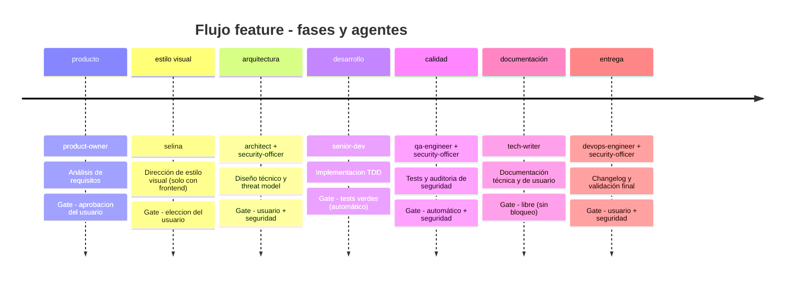

# El equipo

Alfred Dev no es un agente monolítico que intenta saberlo todo y hacerlo todo. Es un equipo de **19 especialistas**, cada uno con un rol delimitado, herramientas restringidas, personalidad propia y quality gates verificables con evidencia. Esta decisión de diseño responde a un principio fundamental: un modelo de IA generalista rinde mejor cuando se le asigna un rol concreto con instrucciones focalizadas que cuando se le pide que sea todo a la vez.

Cada agente se invoca como un subproceso de Codex mediante la herramienta **Agent**. Esto garantiza aislamiento de contexto: el agente arranca con su propio system prompt, sin heredar sesgos ni ruido de conversaciones anteriores. El resultado no se promete determinista, pero sí más controlable: el mismo rol, con las mismas instrucciones y artefactos, reduce variabilidad y facilita revisar si el agente cumplió su contrato.

La filosofía detrás de esta arquitectura se puede resumir en tres principios:

- **Responsabilidad única.** Cada agente tiene un ámbito de actuacion claro. El Artesano escribe código; El Paranoico audita seguridad. Ninguno invade el territorio del otro.
- **Herramientas restringidas.** No todos los agentes necesitan acceso al sistema de ficheros o a la terminal. Limitar las herramientas por agente reduce la superficie de error y fuerza la especialización.
- **Quality gates entre fases.** Ningun artefacto pasa de una fase a la siguiente sin superar un punto de control. Estos gates pueden ser automáticos (tests verdes), manuales (aprobacion del usuario) o combinados (automático + seguridad).

Hay una frontera especialmente importante en el núcleo:

- **`product-owner`** decide **qué** problema se resuelve y **por qué**.
- **`architect`** decide **cómo** se implementa técnicamente.
- **`alfred`** decide **cuándo** interviene cada uno, en qué orden y con qué gate.

Si esas tres responsabilidades se mezclan, el flujo deja de ser previsible. Por eso Alfred coordina, pero no redefine alcance ni diseño por su cuenta.

---

## Flujo feature: cronología de fases

El flujo `feature` es el mas completo del sistema y el que mejor ilustra como colaboran los agentes. Cada feature nueva atraviesa **hasta siete fases** secuenciales: la fase visual `estilo_visual` solo aparece cuando el proyecto tiene frontend. El security-officer aparece en tres fases distintas porque la seguridad no es un paso final sino una preocupacion transversal que acompana al desarrollo desde el diseño hasta la entrega.

El diagrama muestra algo importante: la seguridad no se comprueba al final, sino que interviene en la arquitectura (para validar el threat model), en la calidad (para auditar el código) y en la entrega (para dar el visto bueno final). Esta presencia transversal del security-officer es una decisión deliberada para que los problemas de seguridad se detecten lo antes posible, cuando corregirlos es barato.

---

## Tabla resumen de agentes

Los 19 agentes se dividen en dos categorías: nucleo y opcionales. La tabla siguiente ofrece una vision rápida de cada uno con sus caracteristicas principales.

### Agentes de nucleo

Estos diez agentes forman el nucleo disponible por defecto y la configuración del proyecto no los desactiva. Alfred no los invoca todos a la vez: cada flujo activa el rol que corresponde a la fase, y Selina solo entra cuando hay interfaz de usuario.

| Agente | Alias | Modelo | Tipo | Color | Fase principal |
|--------|-------|--------|------|-------|----------------|
| `alfred` | Alfred | opus | nucleo | azul | orquestación |
| `product-owner` | El Buscador de Problemas | opus | nucleo | verde | producto |
| `architect` | El Dibujante de Cajas | opus | nucleo | cyan | arquitectura |
| `senior-dev` | El Artesano | opus | nucleo | amarillo | desarrollo |
| `security-officer` | El Paranoico | opus | nucleo | rojo | seguridad (transversal) |
| `qa-engineer` | El Rompe-cosas | sonnet | nucleo | magenta | calidad |
| `devops-engineer` | El Fontanero | sonnet | nucleo | naranja | entrega |
| `tech-writer` | El Traductor | sonnet | nucleo | blanco | documentación |
| `project-manager` | SonIA | sonnet | nucleo | magenta | gestion de proyecto |
| `selina` | Selina — La Estilista | opus | nucleo | morado | estilo visual (fase 1b) |

### Agentes opcionales

Estos nueve agentes cubren necesidades específicas que no todos los proyectos tienen. Se activan por configuración.

| Agente | Alias | Modelo | Tipo | Color | Fase principal |
|--------|-------|--------|------|-------|----------------|
| `data-engineer` | El Fontanero de Datos | sonnet | opcional | cyan | datos |
| `ux-reviewer` | El Abogado del Usuario | sonnet | opcional | rosa | UX |
| `performance-engineer` | El Cronometro | sonnet | opcional | amarillo | rendimiento |
| `github-manager` | El Conserje del Repo | sonnet | opcional | gris | GitHub |
| `seo-specialist` | El Rastreador | sonnet | opcional | verde | SEO |
| `copywriter` | El Pluma | sonnet | opcional | magenta | contenido |
| `librarian` | El Bibliotecario | sonnet | opcional | ambar | memoria |
| `i18n-specialist` | La Interprete | sonnet | opcional | cyan | internacionalizacion |
| `lucius` | Lucius — El Director Técnico Externo | opus | opcional | ambar | auditoría técnica externa |

---

## Nucleo vs opcionales

La distinción entre agentes de nucleo y opcionales no es arbitraria. Responde a una pregunta practica: que necesita *cualquier* proyecto de software, y que solo necesitan *algunos* proyectos.

Los **diez agentes de nucleo** existen siempre en el equipo base porque cubren las fases universales del desarrollo: definir que se construye (product-owner), fijar una dirección visual cuando hay frontend (selina), decidir como se construye (architect), construirlo (senior-dev), verificar que funciona (qa-engineer), documentarlo (tech-writer), desplegarlo (devops-engineer), protegerlo (security-officer), gestionar el proyecto y la trazabilidad (project-manager) y orquestarlo todo (alfred). Eso no significa que todos participen en cada respuesta: Alfred los invoca desde los commands del plugin (`feature.md`, `fix.md`, `spike.md`, etc.) segun fase, señales del proyecto y gates. Codex los descubre directamente desde `agents/`; el manifiesto `plugin.json` no declara una seccion `agents` manual.

Los **nueve agentes opcionales** cubren necesidades que dependen del tipo de proyecto. No todos los repositorios tienen base de datos (data-engineer), interfaz de usuario (ux-reviewer), landing publica que posicionar (seo-specialist), textos comerciales que redactar (copywriter), multiples idiomas que gestionar (i18n-specialist) o necesitan una auditoría técnica externa con una perspectiva independiente (lucius). Codex descubre los agentes de plugin directamente desde `agents/`, igual que los diez agentes de núcleo; el manifiesto no mantiene una sección `agents` manual. La configuración local del proyecto (`.local.md`) decide cuales entran en la orquestación automática. El usuario puede invocarlos directamente; Alfred integra automáticamente en fases solo a los que tienen integración declarada y deja el resto como especialistas bajo demanda.

En resumen: los de nucleo siempre estan disponibles porque son imprescindibles; los opcionales se activan bajo demanda porque atienden necesidades específicas.

---

## Modelo de colaboración

Los agentes de Alfred Dev no se comunican entre si directamente. No existe un canal de mensajeria entre ellos ni llamadas de agente a agente. Todo el flujo de información pasa por dos mecanismos:

**El estado de sesión** (`alfred-dev-state.json`) es un fichero JSON que registra en que fase se encuentra el flujo, que fases se han completado, que artefactos se han generado y cual es el resultado de cada gate. Cuando un agente termina su trabajo, el orquestador actualiza el estado y decide, basandose en el resultado de la gate, si se puede avanzar a la siguiente fase.

**Los artefactos** son los entregables que cada agente produce: documentos de requisitos, diagramas de arquitectura, código fuente, informes de tests, changelogs o documentación. Cada artefacto se registra en el estado de sesión con su nombre y el momento en que se genero. El agente de la fase siguiente recibe como contexto los artefactos relevantes de las fases anteriores, pero no el historial de conversacion de esas fases.

**Alfred** (el orquestador) es el único agente con vision global. Conoce el flujo completo, sabe en que fase esta la sesión, evalua las gates y decide que agente invocar a continuacion y con que contexto. Los demas agentes son especialistas ciegos al panorama general: reciben una tarea concreta, la ejecutan y devuelven un resultado. Esta separación es deliberada porque evita que un agente tome decisiones que no le corresponden.

El flujo, simplificado, funciona así:

1. El usuario lanza un comando (por ejemplo, `$alfred-dev:feature`).
2. Alfred crea una sesión y arranca la primera fase.
3. Alfred invoca al agente correspondiente mediante Agent, pasandole su system prompt y los artefactos relevantes.
4. El agente ejecuta su trabajo y devuelve un resultado.
5. Alfred evalua la gate de la fase con el resultado.
6. Si la gate se supera, Alfred avanza a la siguiente fase y repite desde el paso 3.
7. Si la gate no se supera, Alfred informa al usuario y espera correccion o aprobacion.

---

## Distribución de modelos

De los 19 agentes, **7 usan opus** y **12 usan sonnet**. Esta distribución no es aleatoria: refleja la naturaleza de las tareas que realiza cada agente.

Los siete agentes que usan **opus** son los que toman decisiones críticas:

| Agente | Razon para opus |
|--------|-----------------|
| `alfred` | Orquesta todo el sistema; necesita comprension profunda de contexto y capacidad de decisión. |
| `product-owner` | Define requisitos y alcance funcional; un error aquí se propaga a todo el flujo. |
| `architect` | Disena la arquitectura; las decisiones de diseño son dificiles de revertir. |
| `senior-dev` | Escribe código de produccion; la calidad del código es directamente proporcional a la capacidad del modelo. |
| `security-officer` | Evalua amenazas y vulnerabilidades; un falso negativo aquí tiene consecuencias graves. |
| `selina` | Define dirección visual y sistema de diseño en proyectos con UI; sus decisiones afectan la experiencia final del usuario. |
| `lucius` | Coordina la auditoría técnica externa invocando Codex CLI; necesita razonamiento profundo para sintetizar el informe y decidir qué prescripciones son accionables. |

Los trece agentes restantes usan **sonnet**, que es mas rápido y eficiente en coste. Sus tareas, aunque importantes, son de naturaleza mas estructurada: ejecutar tests y reportar resultados (qa-engineer), generar documentación a partir de artefactos existentes (tech-writer), gestionar pipelines (devops-engineer) o realizar revisiones acotadas a un ámbito concreto (ux-reviewer, seo-specialist, etc.). Sonnet resuelve estas tareas con solvencia y permite que los flujos avancen mas rápido sin sacrificar calidad donde no es critica.

---

## Por que Agent y no invocación directa

Los agentes se descubren desde el directorio `agents/` y se usan principalmente como subagentes lanzados por los commands del plugin mediante la herramienta **Agent** de Codex. Esta decisión tiene tres ventajas fundamentales:

**Aislamiento de contexto.** Cada agente arranca con un contexto limpio: su system prompt y los artefactos que Alfred le pasa. No hereda la conversacion acumulada de la sesión ni el contexto de otros agentes. Esto evita un problema habitual de los sistemas multiagente: la contaminación cruzada, donde las instrucciones o sesgos de un agente afectan al siguiente.

**Control de herramientas.** Cada llamada a Agent puede restringir las herramientas disponibles para el subagente. Un tech-writer no necesita acceso a la terminal; un qa-engineer no necesita escribir ficheros de produccion. Limitar las herramientas reduce la superficie de errores accidentales y fuerza a cada agente a trabajar dentro de su ámbito.

**Paralelismo.** La subagents de Codex permite lanzar dos o mas subagentes en paralelo. En el runtime actual, el paralelismo se usa sobre todo en arquitectura y calidad del flujo `feature`, en la validación de `fix`, en la exploración de `spike` y en las auditorías de `ship` y `audit`. La fase `entrega` de `feature` mantiene dos agentes, pero no se modela como paralela en `core/orchestrator.py`.

---

## Navegación

Cada agente tiene una ficha individual con su system prompt completo, herramientas disponibles, quality gates que evalua y ejemplos de interacción. La tabla siguiente enlaza a todas las fichas.

| Agente | Ficha | Descripción |
|--------|-------|-------------|
| `alfred` | [alfred.md](alfred.md) | Orquestador general del sistema; gestiona sesiones, flujos y delegacion. |
| `product-owner` | [product-owner.md](product-owner.md) | Define requisitos funcionales, historias de usuario y criterios de aceptacion. |
| `architect` | [architect.md](architect.md) | Disena la arquitectura técnica, elige patrones y valida la viabilidad del diseño. |
| `senior-dev` | [senior-dev.md](senior-dev.md) | Implementa el código de produccion con TDD estricto y clean code. |
| `security-officer` | [security-officer.md](security-officer.md) | Audita seguridad de forma transversal: threat model, code review y validación final. |
| `qa-engineer` | [qa-engineer.md](qa-engineer.md) | Ejecuta y disena tests; busca edge cases y regresiones. |
| `devops-engineer` | [devops-engineer.md](devops-engineer.md) | Gestiona CI/CD, pipelines, despliegues y empaquetado de releases. |
| `tech-writer` | [tech-writer.md](tech-writer.md) | Genera documentación técnica y de usuario comprensible para la comunidad. |
| `project-manager` | [project-manager.md](project-manager.md) | Materializa kanban, trazabilidad y siguiente paso operativo a partir del estado del flujo; no decide producto ni arquitectura. |
| `selina` | [selina.md](selina.md) | Define la dirección visual del producto y cierra la fase 1b cuando hay frontend. |
| `data-engineer` | [data-engineer.md](data-engineer.md) | Disena esquemas de datos, migraciones y optimiza queries. |
| `ux-reviewer` | [ux-reviewer.md](ux-reviewer.md) | Revisa accesibilidad, flujos de usuario y coherencia de la interfaz. |
| `performance-engineer` | [performance-engineer.md](performance-engineer.md) | Mide y optimiza rendimiento: tiempos de carga, bundles y metricas clave. |
| `github-manager` | [github-manager.md](github-manager.md) | Gestiona issues, PRs, labels, releases y configuración del repositorio. |
| `seo-specialist` | [seo-specialist.md](seo-specialist.md) | Optimiza el posicionamiento: meta tags, datos estructurados y Core Web Vitals. |
| `copywriter` | [copywriter.md](copywriter.md) | Redacta textos comerciales, CTAs y contenido con tono coherente y ortografia impecable. |
| `librarian` | [librarian.md](librarian.md) | Gestiona la memoria persistente del proyecto: decisiones, historial y consultas. |
| `i18n-specialist` | [i18n-specialist.md](i18n-specialist.md) | Audita claves i18n, detecta cadenas hardcodeadas y valida formatos por locale. |
| `lucius` | [lucius.md](lucius.md) | Auditoría técnica externa vía Codex CLI; diagnóstico y prescripción por ítem. |
