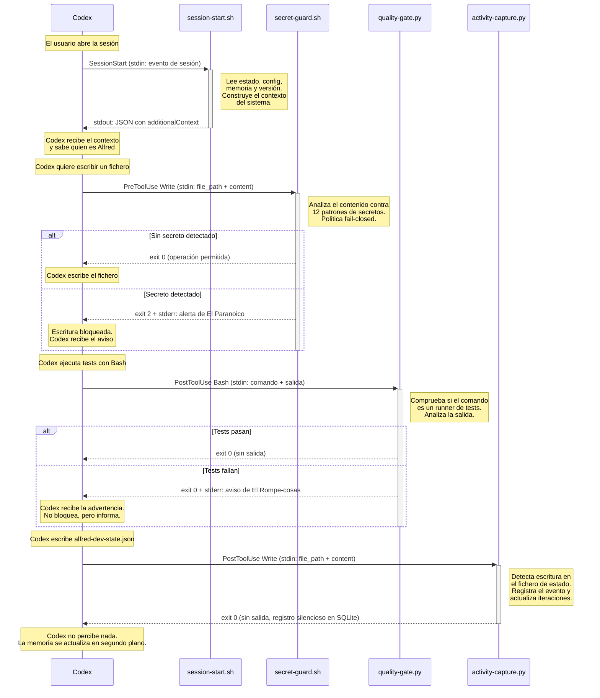

# Sistema de hooks

Los hooks son la pieza que conecta Alfred Dev con el ciclo de vida de Codex. Codex emite eventos en momentos clave de la sesión --al arrancar, antes de usar una herramienta, despues de usarla, al intentar parar-- y permite que los plugins registren scripts que se ejecutan en respuesta a esos eventos. Es, en esencia, un sistema de observadores tipificados: cada hook se suscribe a un tipo de evento concreto, con un filtro opcional (matcher) que restringe sobre que herramientas actua, y Codex se encarga de invocarlo en el momento preciso.

Para Alfred Dev, los hooks son el sistema nervioso del plugin. Son lo que permite inyectar contexto al arrancar la sesión para que Codex sepa quien es Alfred y que puede hacer, bloquear escrituras que contengan secretos antes de que lleguen al disco, vigilar que los tests pasen despues de cada ejecución, detectar cambios en dependencias, corregir tildes, capturar eventos en la memoria persistente y evitar que el usuario cierre la sesión con trabajo pendiente. Sin los hooks, Alfred seria un conjunto de skills pasivos esperando a que alguien los invoque; con ellos, es un sistema proactivo que vigila, informa y protege en tiempo real.

---

## Como funcionan los hooks en Codex

El mecanismo de hooks de Codex sigue un modelo sencillo de registro, invocación y respuesta. Entender este modelo es imprescindible para comprender por que cada hook de Alfred esta disenado como lo esta.

### Registro

Los hooks se declaran en el fichero `hooks/hooks.json` del repositorio. Cada entrada asocia un evento del ciclo de vida con uno o mas scripts a ejecutar. La estructura básica es:

```json
{
  "hooks": {
    "NombreDelEvento": [
      {
        "matcher": "regex_que_filtra_herramientas",
        "hooks": [
          {
            "type": "command",
            "command": "ruta/al/script.sh",
            "timeout": 10,
            "async": false
          }
        ]
      }
    ]
  }
}
```

El campo `matcher` solo debe usarse en eventos donde Codex lo soporta. En Alfred se usa para filtrar nombre de herramienta (`PreToolUse` y `PostToolUse`) o tipo de sesión (`SessionStart`). `UserPromptExpansion` también soporta filtrar por `command_name`, pero Alfred lo omite deliberadamente para capturar skill mentions, prompts MCP expandidos y rutas legacy con el mismo hook fail-open. Si no se específica matcher, el hook se ejecuta para todas las invocaciones de ese evento. Esta distinción es importante: un hook de `PostToolUse` sin matcher se ejecutaria despues de cada operación de cualquier herramienta, lo que generaria un coste de rendimiento innecesario. En eventos como `UserPromptSubmit`, `Stop`, `PostToolBatch`, `TaskCreated`, `TaskCompleted`, `WorktreeCreate`, `WorktreeRemove`, `CwdChanged`, `MessageDisplay` y `TeammateIdle`, Codex ignora `matcher`; `release:audit` falla si Alfred declara un matcher ahí para no crear una falsa sensación de filtrado. El campo `if` solo se evalua en eventos de herramientas (`PreToolUse`, `PostToolUse`, `PostToolUseFailure`, `PermissionRequest` y `PermissionDenied`); en cualquier otro evento no debe usarse porque el handler no se ejecutaria.

### Invocación

Cuando Codex emite un evento que coincide con un hook registrado, ejecuta el script indicado como un proceso externo. La información del evento se pasa por **stdin** en formato JSON. El contenido exacto del JSON varia segun el tipo de evento, pero tipicamente incluye:

- `tool_name`: nombre de la herramienta que disparo el evento (Write, Edit, Bash, etc.).
- `tool_input`: parámetros que Codex envio a la herramienta (ruta del fichero, contenido, comando...).
- `tool_output`: resultado de la herramienta (solo disponible en `PostToolUse`).

### Respuesta

El script responde a traves de tres canales:

| Canal | Propósito |
|-------|-----------|
| **stdout** | Respuesta estructurada (JSON). Codex lo interpreta segun el tipo de evento. En `SessionStart` y `PreCompact`, el campo `hookSpecificOutput.additionalContext` se inyecta como contexto de la conversacion. En `Stop`, un objeto con `"decision": "block"` impide que Codex se detenga. Cuando el aviso debe ser estructurado para el usuario, el JSON puede incluir `systemMessage`. |
| **stderr** | Mensajes breves de diagnostico o aviso. Codex los muestra segun el evento; Alfred lo mantiene para avisos informativos de hooks existentes como calidad, dependencias y ortografia. |
| **Exit code** | `0` indica operación permitida, `2` indica bloqueo (solo relevante en `PreToolUse`). Cualquier otro código no cero se trata como error del hook y se ignora. |

### Modos de ejecución

Los hooks pueden ser **sincronos** o **asincronos**. En modo síncrono (por defecto), Codex espera a que el script termine antes de continuar. Esto es imprescindible para hooks que necesitan bloquear una operación, como `secret-guard.sh`. En modo asíncrono (`"async": true`), Codex lanza el script y continua sin esperar el resultado, lo que es apropiado para hooks de inyección de contexto como `session-start.sh`.

Cada hook tiene un **timeout configurable** en segundos. Si el script no termina dentro del plazo, Codex lo mata y continua como si no existiera. Este mecanismo protege contra scripts colgados que podrian bloquear la sesión indefinidamente.

---

## Los 13 hooks de Alfred Dev

Alfred Dev registra trece hooks visibles que cubren los eventos del ciclo de vida: arranque de sesión, envio de prompt, parada, antes de usar una herramienta, despues de usarla y compactación. Cada hook tiene una responsabilidad única y esta disenado para fallar de forma segura: si algo va mal internamente, el hook sale con código 0 (sin bloquear) excepto en los casos donde la politica de seguridad exige fail-closed.

### session-bootstrap.sh

**Evento:** `SessionStart` -- **Matcher:** `startup|resume|clear|compact` -- **Timeout:** 10 s -- **Asíncrono:** no

Este hook ligero existe para eliminar una carrera del primer arranque en Codex CLI. Su misión es puramente operativa: preparar el proyecto antes de que Codex procese el primer prompt. Hace cinco cosas, todas idempotentes y locales al repo:

1. crea o corrige `.codex/alfred-dev.local.md` con autonomía CLI-first y memoria activada;
2. crea `.codex/alfred-memory.db` si aún no existe;
3. genera `.codex/settings.local.json` y `.codex/settings.json` con la allowlist mínima para los comandos helper-first;
4. crea el wrapper local `.codex/alfred-continuity.py`;
5. asegura una iteración `session` activa en la SQLite del proyecto.

El wrapper vive en el proyecto para que Codex pueda ejecutar helpers con
una regla Bash local y acotada, pero no confia solo en una ruta absoluta de
cache: primero usa `ALFRED_CODEX_PLUGIN_ROOT` si está disponible, luego el fallback
embebido y, si esa instalación ya fue rotada, busca la cache activa de
`alfred-dev`.

No inyecta contexto adicional en Codex ni hace llamadas de red. Precisamente por eso es síncrono: tiene que terminar antes de que el primer slash command dependa de esos artefactos.

### session-start.sh

**Evento:** `SessionStart` -- **Matcher:** `startup|resume|clear|compact` -- **Asíncrono:** si

Este es el hook mas complejo del plugin y se ejecuta justo despues del bootstrap síncrono. Su misión es construir el contexto inicial que Codex recibe al arrancar, de modo que sepa quien es Alfred, que comandos tiene disponibles, cual es la configuración del proyecto y si hay una sesión de trabajo activa que retomar.

El script recorre cinco fuentes de información, cada una opcional y con fallo silencioso:

1. **Presentacion del plugin.** Un bloque estático que describe el equipo de agentes (incluyendo SonIA), las rutas disponibles (`$alfred-dev:alfred`, `$alfred-dev:map-codebase`, `$alfred-dev:discuss`, `$alfred-dev:next`, `$alfred-dev:pause`, `$alfred-dev:resume`, `$alfred-dev:progress`, `$alfred-dev:verify`, `$alfred-dev:quick`, `$alfred-dev:feature`, `$alfred-dev:fix`, `$alfred-dev:spike`, `$alfred-dev:ship`, `$alfred-dev:audit`, `$alfred-dev:lucius`, `$alfred-dev:config`, `$alfred-dev:status`, `$alfred-dev:update`, `$alfred-dev:help`) y las reglas de operación (quality gates verificables con evidencia, TDD estricto, auditoria de seguridad por fase).

2. **Configuración local del proyecto.** Lee `.codex/alfred-dev.local.md` si existe. Este fichero permite al usuario definir preferencias por proyecto (lenguaje, framework, convenciones específicas) que Codex incorpora a su comportamiento.

3. **Estado de sesión activa.** Lee `.codex/alfred-dev-state.json` para detectar si hay un flujo en curso (feature, fix, spike...). Si lo hay y no esta completado, extrae el comando activo, la fase actual, la descripción y las fases completadas. Esto permite que Codex retome el trabajo donde lo dejo.

4. **Memoria persistente.** Si existe `.codex/alfred-memory.db`, consulta la base de datos SQLite a traves del modulo `core.memory` para obtener las ultimas cinco decisiones registradas y la iteracion activa, si la hay. Esto proporciona contexto histórico sin necesidad de releer toda la conversacion anterior.

5. **Comprobacion de actualizaciones.** Consulta la API de GitHub (`https://api.github.com/repos/686f6c61/alfred-dev/releases/latest`) con un timeout de 3 segundos. Si hay una versión nueva con formato semántico válido distinta de la actual, añade un aviso al contexto. La validación del formato de versión (`^[0-9]+\.[0-9]+\.[0-9]+(-[a-zA-Z0-9.]+)?$`) evita inyección de contenido arbitrario desde la respuesta de la API.

La salida es un JSON con la clave `hookSpecificOutput.additionalContext` que Codex inyecta como contexto del sistema. Para generar JSON seguro, el contenido se escapa a traves de `python3 -c "import json..."` en lugar de hacerlo con manipulación de cadenas en bash, lo que evita problemas con caracteres especiales.

### stop-hook.py

**Evento:** `Stop` -- **Matcher:** ninguno -- **Timeout:** 10 s

El hook de Stop implementa un patron tomado del plugin ralph-loop: cuando Codex intenta detenerse, comprueba si hay trabajo pendiente y, en caso afirmativo, bloquea la parada con un mensaje que explica por que debe seguir.

El mecanismo funciona así: lee `alfred-dev-state.json`, extrae la fase actual y la compara con la definición del flujo importada desde `core.orchestrator.FLOWS`. Si la sesión existe, no esta completada y la fase tiene una quality gate pendiente, emite un JSON con `"decision": "block"` y un mensaje que incluye:

- El nombre del flujo activo y su descripción.
- La fase actual con sus agentes asignados.
- El tipo de gate pendiente (automático, seguridad, usuario, libre) con instrucciones específicas para cada caso.

La razon de este hook es evitar que el usuario cierre Codex a mitad de un flujo, perdiendo el contexto de trabajo. El tono del mensaje es deliberadamente directo ("Eh eh eh, para el carro") porque la experiencia demuestra que los mensajes educados se ignoran con mas facilidad.

Si no hay sesión activa, la sesión esta completada o el estado es incoherente, el hook sale con código 0 sin salida, dejando que Codex pare normalmente.

### secret-guard.sh

**Evento:** `PreToolUse` -- **Matcher:** `Write|Edit` -- **Timeout:** 5 s

Este es el único hook que bloquea operaciones de forma activa. Se ejecuta **antes** de que Codex escriba o edite un fichero, analiza el contenido que pretende escribir y, si detecta un patron de secreto, impide la operación con exit code 2.

La politica de seguridad es **fail-closed**: si el script no puede parsear la entrada de stdin o no puede cargar la fuente canónica de patrones (`core/secrets.py`), bloquea por precaucion. Esta decisión es deliberada: es preferible un falso positivo que obliga a reintentar a un falso negativo que deja un secreto expuesto en el repositorio.

El script detecta 12 familias de patrones de secretos, mas un patron genérico de asignación de credenciales:

| Patron | Descripción |
|--------|-------------|
| `AKIA[0-9A-Z]{16}` | AWS Access Key |
| `sk-[a-zA-Z0-9]{20,}` | Clave API con prefijo sk- (OpenAI, Stripe u otros) |
| `sk-ant-[a-zA-Z0-9\-]{20,}` | Anthropic API Key |
| `ghp_[a-zA-Z0-9]{36}` / `github_pat_...` | GitHub Personal Access Token |
| `xox[bpsa]-...` | Slack Token |
| `AIza[0-9A-Za-z\-_]{35}` | Google API Key |
| `SG\.xxx.xxx` | SendGrid API Key |
| `-----BEGIN ... PRIVATE KEY-----` | Clave privada PEM/SSH |
| `eyJ...` (tres segmentos base64) | JWT token hardcodeado |
| `mysql://...@`, `postgresql://...@`, etc. | Connection string con credenciales |
| `hooks.slack.com/services/...` | Slack Webhook URL |
| `discord.com/api/webhooks/...` | Discord Webhook URL |
| Asignación directa (`password = "..."`, etc.) | Credencial hardcodeada en código |

Los ficheros de entorno reales se excluyen del análisis porque son el lugar legitimo para guardar secretos. La exclusion cubre `.env`, `.env.local`, `local.env` y variantes reales de `.env.*`, pero **no** plantillas como `.env.example`, `.env.sample`, `.env.template` o `.env.dist`, que se suelen versionar y por tanto no deben contener secretos reales.

Cuando el hook bloquea, emite un mensaje en la voz de "El Paranoico" que explica que patron se detecto, por que no se debe hardcodear secretos y donde deberian ir (fichero `.env`, variables de entorno, gestor de secretos).

### dangerous-command-guard.py

**Evento:** `PreToolUse` -- **Matcher:** `Bash` -- **Timeout:** 5 s

Este hook actua como segunda linea de defensa contra comandos destructivos. Se ejecuta antes de cada invocación de Bash, analiza el comando y lo bloquea (exit 2) si coincide con un patron potencialmente catastrofico.

Ademas, desde `0.4.5` autoaprueba una allowlist muy estrecha de helpers
deterministas locales de Alfred (`python3 .codex/alfred-continuity.py ...`)
para que los comandos helper-first puedan arrancar en headless sin pedir
permiso manual en su primer uso.

A diferencia de los hooks informativos, la politica de este hook es **fail-closed**: si no puede parsear la entrada, bloquea por precaucion. La razon es la misma que en `secret-guard.sh`: un guard de seguridad que falla en abierto deja la puerta abierta justo en el peor momento.

El hook vigila 10 familias de patrones peligrosos:

| Patron | Descripción |
|--------|-------------|
| `rm -rf /` (o `~`, `$HOME`, `/usr`, etc.) | Borrado catastrofico del sistema, home o directorios de sistema. Cubre flags juntas (`-rf`), separadas (`-r -f`) y con `sudo`. |
| `git push --force main/master` | Force push a rama protegida con riesgo de perdida de historial. |
| `git push --force` (sin rama) | Force push sin rama explícita: avisa de que puede afectar a main/master. |
| `DROP DATABASE/TABLE/SCHEMA` | Destruccion de datos en base de datos (case-insensitive). |
| `docker system prune -af` | Eliminacion de todos los datos de contenedores, volumenes e imagenes. |
| `chmod -R 777 /` | Permisos inseguros sobre directorio raiz. |
| `:(){ :\|:& };:` | Fork bomb: denegación de servicio local. |
| `mkfs.* /dev/*` | Formateo de disco sobre dispositivo de bloque. |
| `dd of=/dev/sd*` | Escritura directa a dispositivo de bloque con dd. |
| `git reset --hard origin/main` | Descarta todos los cambios locales contra la rama remota. |

El mensaje de bloqueo incluye el comando truncado (200 caracteres), la descripción del riesgo y la sugerencia de ejecutar el comando manualmente si es realmente necesario.

### sensitive-read-guard.py

**Evento:** `PreToolUse` -- **Matcher:** `Read` -- **Timeout:** 5 s

Este hook emite un aviso informativo cuando Codex intenta leer un fichero que puede contener credenciales o claves privadas. A diferencia de los otros hooks de seguridad, no bloquea la operación: su propósito es alertar al agente para que tenga cuidado de no filtrar el contenido en respuestas, commits o artefactos generados.

El hook reconoce dos tipos de patrones:

**Por nombre base del fichero:** variables de entorno (`.env`, `.env.*`), claves privadas (`.pem`, `.key`, `.p12`, `.pfx`), claves SSH (`id_rsa`, `id_ed25519`, `id_ecdsa`), credenciales de servicios (`credentials.json`, `service-account.json`, `service-account.*.json`, `firebase-adminsdk*.json`, `.npmrc`, `.pypirc`, `terraform.tfstate`), ficheros de contrasenas (`.htpasswd`) y almacenes de claves Java (`.jks`, `.keystore`).

**Por ruta completa:** credenciales AWS (`.aws/credentials`, `.aws/config`), Docker (`.docker/config.json`), Kubernetes (`.kube/config`), estado local de Terraform (`.terraform/terraform.tfstate`), directorio SSH (`.ssh/`) y directorio GPG (`.gnupg/`).

La politica es estrictamente informativa: siempre sale con exit 0. Si no puede parsear la entrada, sale silenciosamente sin avisar.

### prefetch-finish-guard.py

**Evento:** `PreToolUse` -- **Matcher:** `Read|Write|Edit|Glob|Grep` -- **Timeout:** 5 s

Este hook cubre dos situaciones complementarias:

1. si existe un prefetch helper-first pendiente para `alfred`, `map-codebase`,
   `discuss`, `feature`, `fix`, `spike`, `ship`, `audit`, `lucius` o `memory-ui`,
   bloquea lecturas y exploracion hasta que Codex ejecute `consume-prefetch`;
2. justo despues de consumir con exito `.codex/alfred-prefetch.json`, bloquea
   temporalmente lecturas, escrituras y exploracion adicional para forzar que
   Codex responda con el resultado ya preparado por el helper en vez de rehacer
   el trabajo manualmente.

La barrera es transitoria: se limpia al llegar un prompt nuevo y tambien al
cierre de sesion. Si el marcador ha expirado o esta corrupto, el hook lo borra
y permite seguir sin bloquear.

### quality-gate.py

**Evento:** `PostToolUse` -- **Matcher:** `Bash` -- **Timeout:** 10 s

Este hook vigila la salida de los comandos Bash para detectar ejecuciones de tests con resultados fallidos. A diferencia de `secret-guard.sh`, no bloquea: informa por stderr con la voz de "El Rompe-cosas" para que Codex sepa que debe corregir los fallos antes de avanzar.

El hook opera en dos fases. Primero determina si el comando ejecutado corresponde a un runner de tests, comparando la cadena del comando contra una lista de 17 patrones regex que cubren los ecosistemas mas comunes:

`pytest`, `vitest`, `jest`, `mocha`, `cargo test`, `go test`, `npm test`, `pnpm test`, `bun test`, `yarn test`, `python -m unittest`, `phpunit`, `rspec`, `mix test`, `dotnet test`, `maven test` / `mvn test` y `gradle test`.

Los runners de una sola palabra (`pytest`, `jest`, `vitest`, `mocha`, etc.) usan un ancla de posición de comando (`(?:^|[;&|])\s*`) que exige que el runner aparezca al inicio de la cadena o tras un operador shell, lo que evita falsos positivos como `cat pytest.ini` o `grep jest config.js`. Los runners de varias palabras (`cargo test`, `npm test`, etc.) usan limites de palabra (`\b`) porque su prefijo los ancla de forma natural.

Si el comando es un runner de tests, la segunda fase analiza stdout y stderr buscando patrones de fallo. Si la salida no permite decidir pero el runner devolvio `exit_code != 0`, tambien se considera fallo. El hook tolera tanto el payload historico `tool_output` como el payload actual `tool_result`, para no depender de una sola variante del runtime.

### dependency-watch.py

**Evento:** `PostToolUse` -- **Matcher:** `Write|Edit` -- **Timeout:** 10 s

Cada nueva dependencia es una superficie de ataque que el proyecto acepta de forma implícita. Este hook existe para hacer explícita esa decisión: cuando Codex modifica un manifiesto o lockfile de dependencias, emite un aviso en la voz de "El Paranoico" que invita a reflexionar sobre la necesidad, el mantenimiento y las implicaciones de seguridad de la dependencia anadida.

El hook reconoce manifiestos de dependencias de 11 ecosistemas: Node.js (`package.json`, `package-lock.json`, `yarn.lock`, `pnpm-lock.yaml`, `bun.lockb`, `bun.lock`, `pnpm-workspace.yaml`), Python (`pyproject.toml`, `requirements.txt` y variantes, `requirements.in`, `constraints.txt` y variantes, `setup.py`, `setup.cfg`, `Pipfile`, `Pipfile.lock`, `poetry.lock`, `uv.lock`), Rust (`Cargo.toml`, `Cargo.lock`), Go (`go.mod`, `go.sum`), Ruby (`Gemfile`, `Gemfile.lock`), Elixir (`mix.exs`, `mix.lock`), PHP (`composer.json`, `composer.lock`), Java/Kotlin/Scala (`pom.xml`, `build.gradle`, `build.gradle.kts`), .NET (`packages.config`, `packages.lock.json`, `Directory.Packages.props`, `.csproj`, `.fsproj`, `.vbproj`) y Swift (`Package.swift`, `Package.resolved`).

La detección se basa en el nombre base del fichero (sin ruta), lo que la hace independiente de la estructura de directorios del proyecto. En manifests mixtos como `package.json` o `pyproject.toml`, el hook intenta reducir ruido: si una edición solo toca metadata lateral (`scripts`, `version`, etc.) y no una sección de dependencias, permanece en silencio.

### spelling-guard.py

**Evento:** `PostToolUse` -- **Matcher:** `Write|Edit` -- **Timeout:** 10 s

Los proyectos que documentan en castellano necesitan coherencia ortografica, y las tildes son el error mas frecuente. Este hook actua como un corrector pasivo: despues de cada escritura o edicion, analiza el contenido buscando palabras castellanas comunes escritas sin tilde y emite un aviso si encuentra alguna.

El diccionario contiene aproximadamente 80 pares de palabras agrupados por terminación (`-cion`, `-ia`, `-ico/-ica`, `-as/-en/-es/-on`), con un filtrado automático que elimina las entradas donde la forma sin tilde es correcta (como "estrategia" o "dependencia"). Algunos ejemplos del diccionario:

| Sin tilde | Con tilde |
|-----------|-----------|
| `función` | `función` |
| `método` | `método` |
| `código` | `código` |
| `parámetro` | `parámetro` |
| `automático` | `automático` |
| `configuración` | `configuración` |
| `sesión` | `sesión` |
| `análisis` | `análisis` |

Los patrones se compilan en una única expresión regular con limites de palabra y busqueda case-insensitive para capturar variantes como "Función", "FUNCIÓN" o "función". El umbral mínimo de hallazgos para emitir aviso es de 1 palabra (configurable via `MIN_FINDINGS`).

El hook solo inspecciona ficheros con extensiones de texto donde es probable encontrar castellano: `.md`, `.txt`, `.html`, `.py`, `.js`, `.ts`, `.jsx`, `.tsx`, `.vue`, `.svelte`, `.astro`, `.sh`, `.bash`, `.zsh`, `.css`, `.scss`, `.xml`, `.svg`, `.rst`, `.adoc` y `.toml`. Ignora rutas dentro de `node_modules`, `.git`, `dist`, `build`, `__pycache__`, `.next`, `.nuxt`, `.venv`, `venv` y `env`.

Para reducir ruido, no revisa el contenido tal cual: en Markdown ignora bloques y spans de código, en HTML/XML/SVG elimina tags y se queda con texto visible y atributos de interfaz (`aria-label`, `title`, `placeholder`, `alt`), en CSS/SCSS revisa solo comentarios, en TOML ignora claves técnicas y mira comentarios/valores, y de forma global descarta URLs, rutas, flags largos (`--version`) y tokens tipo path. Eso evita avisos molestos por ejemplos de CLI, selectores CSS o rutas como `/api/version/publico`.

### activity-capture.py

**Evento:** `PostToolUse` -- **Matcher:** `Write|Edit|Bash|Read|Glob|Grep|Agent|WebFetch|WebSearch|NotebookEdit` + `UserPromptSubmit` + `UserPromptExpansion` + `PreCompact` + `Stop` -- **Timeout:** 10 s

Este hook centraliza toda la captura de actividad en un único punto de entrada. Sustituye a los antiguos `memory-capture.py` y `commit-capture.py` (unificados en v0.3.6) y además amplia la cobertura a practicamente todas las herramientas de Codex, los prompts del usuario, la expansion directa de skill mentions, la compactación de contexto y el cierre de sesión. En `UserPromptSubmit` y `UserPromptExpansion` también hace una preparación helper-first muy acotada para continuidad: puede dejar listo `map-codebase`, `discuss`, `quick`, `feature`, `fix`, `spike`, `ship`, `audit` o `lucius` antes de que el modelo entre en el razonamiento principal, e incluso preparar `map-codebase` cuando `$alfred-dev:alfred` entra por un repo brownfield sin mapa previo.

El hook registra cada evento en la base de datos SQLite de memoria persistente (`alfred-memory.db`) con tres niveles de detalle:

| Nivel | Propósito |
|-------|-----------|
| `summary` | Texto legible en castellano (una linea), pensado para listados rapidos. |
| `payload` | JSON estructurado con los campos clave del evento, pensado para filtrado programático. |
| `content` | Texto completo cuando aporta valor directo; en herramientas de alto volumen (`Glob`, `Grep`, `WebFetch`, `WebSearch`) se guarda un preview recortado con metadatos de truncado para evitar ruido excesivo. |

La tabla de dispatchers mapea cada tipo de evento a su función de procesamiento:

| Evento | Tipo | Que captura |
|--------|------|-------------|
| `Write` | PostToolUse | Fichero escrito: ruta, extensión, lineas y contenido completo. Si el fichero es `alfred-dev-state.json`, dispara además la lógica de seguimiento de iteraciones y fases. |
| `Edit` | PostToolUse | Fichero editado: diff old/new con conteo de lineas. |
| `Bash` | PostToolUse | Comando ejecutado: comando, exit code, stdout y stderr completos. Si detecta un `git commit` exitoso, captura además los metadatos del commit (SHA, mensaje, autor, ficheros). |
| `Read` | PostToolUse | Fichero leido: ruta y rango de lineas solicitado (sin contenido duplicado). |
| `Glob` | PostToolUse | Busqueda por patron: patron, directorio y número de resultados. Si la lista es enorme, guarda solo un preview con marca de recorte. |
| `Grep` | PostToolUse | Busqueda de contenido: patron regex, directorio, modo y coincidencias. Si la salida es masiva, guarda preview + metadatos de truncado. |
| `Agent` | PostToolUse | Subagente lanzado: tipo, descripción, prompt y resultado completo. |
| `WebFetch` | PostToolUse | Peticion HTTP: URL y respuesta. Las respuestas muy grandes se recortan con metadatos de volumen. |
| `WebSearch` | PostToolUse | Busqueda web: query y resultados. Los resultados muy grandes se guardan como preview. |
| `NotebookEdit` | PostToolUse | Edicion de notebook Jupyter: ruta y comando. |
| `UserPromptSubmit` | Evento propio | Prompt del usuario: texto completo. Si es un slash command helper-first de Alfred, prepara antes los artefactos de continuidad y registra `alfred_prefetched`. |
| `UserPromptExpansion` | Evento propio | Skill mention o prompt MCP expandido antes de llegar a Codex. Registra `expansion_type`, `command_name` y `command_source` cuando Codex los entrega, y cubre la ruta directa `$alfred-dev:alfred` que no pasa por `PreToolUse`. |
| `PreCompact` | Evento propio | Marcador de compactación de contexto. |
| `Stop` | Evento propio | Cierre de sesión: marca el fin y cierra la iteracion activa si existe. |

La memoria solo esta activa si el usuario la ha habilitado explícitamente en `.codex/alfred-dev.local.md` con la sección `memoria: enabled: true`. El hook comprueba esta configuración antes de hacer nada, y si no esta habilitada, sale inmediatamente.

El hook excluye automáticamente ficheros de rutas internas (`.codex/`, `.git/`, `node_modules/`, `__pycache__/`, `.venv/`) y comandos triviales de lectura o navegación (`ls`, `pwd`, `cat`, etc.) para evitar ruido en el historial.

La lógica de seguimiento de iteraciones y fases (heredada de `memory-capture.py`) se activa cuando se escribe `alfred-dev-state.json`. Captura tres tipos de eventos de flujo: `iteration_started` (si no hay iteracion activa), `phase_completed` (fases nuevas que aun no estan registradas) e `iteration_completed` (cuando la fase actual pasa a `"completado"`).

La detección de commits (heredada de `commit-capture.py`) se basa en la regex `(?:^|&&|\|\||;)\s*git\s+commit\b` y se activa solo si el exit code es 0. Ejecuta `git log -1` para extraer SHA, mensaje, autor y ficheros, y los registra con `MemoryDB.log_commit()`, que es idempotente por SHA.

La politica es **fail-open**: cualquier error se imprime en stderr con prefijo `[activity-capture]` y el hook sale con código 0 sin bloquear el flujo.

### memory-compact.py

**Evento:** `PreCompact` -- **Matcher:** ninguno -- **Timeout:** 10 s

Cuando Codex compacta el contexto de la conversacion para liberar espacio en la ventana, el contexto histórico acumulado durante la sesión se pierde o se resume de forma genérica. Este hook protege las decisiones críticas de la sesión inyectandolas como contexto adicional que sobrevive a la compactación.

El mecanismo funciona así: al recibir el evento PreCompact, el hook consulta la memoria persistente para obtener las decisiones relevantes. Si hay una iteracion activa, obtiene las decisiones de esa iteracion; si no, obtiene las 5 ultimas decisiones globales. Con esa lista, genera un bloque de texto Markdown que resume cada decisión (titulo, opcion elegida, fecha) y lo emite como JSON con `hookSpecificOutput.hookEventName: "PreCompact"` y `hookSpecificOutput.additionalContext`.

Codex incorpora este texto como contexto del sistema en la conversacion compactada, asegurando que las decisiones del proyecto no se pierdan aunque el contexto de conversacion se reduzca.

La politica es **fail-open**: si la memoria no esta disponible, no hay decisiones o cualquier error ocurre, el hook sale con código 0 sin salida, y la compactación procede normalmente sin contexto adicional.

---

## Diagrama de interacción

El siguiente diagrama muestra como interactuan los hooks con Codex durante una sesión típica. Los cuatro hooks representados cubren los cuatro eventos del ciclo de vida; los otros (`stop-hook.py`, `dangerous-command-guard.py`, `sensitive-read-guard.py`, `dependency-watch.py` y `spelling-guard.py`) siguen patrones analogos a los representados.



---

## Tabla resumen

| Evento | Matcher | Script | Timeout | Asíncrono | Bloquea | Que vigila |
|--------|---------|--------|---------|-----------|---------|------------|
| `SessionStart` | `startup\|resume\|clear\|compact` | `session-bootstrap.sh` | 10 s | No | No | Bootstrap síncrono del proyecto: config local, memoria, permisos y wrapper helper-first. |
| `SessionStart` | `startup\|resume\|clear\|compact` | `session-start.sh` | -- | Si | No | Inyección de contexto al arrancar: presentacion, configuración, estado de sesión, memoria y actualizaciones. |
| `Stop` | _(ninguno)_ | `stop-hook.py` | 10 s | No | Si | Sesiones activas con gates pendientes. Impide cerrar Codex con trabajo sin terminar. |
| `PreToolUse` | `Read\|Write\|Edit\|Glob\|Grep` | `prefetch-finish-guard.py` | 5 s | No | Si | Evita deriva tras `consume-prefetch`: si el helper-first ya resolvió el comando, bloquea exploración y reescrituras adicionales. |
| `PreToolUse` | `Write\|Edit` | `secret-guard.sh` | 5 s | No | Si | Secretos en el contenido de ficheros: claves API, tokens, credenciales hardcodeadas, connection strings, webhooks. |
| `PreToolUse` | `Bash` | `dangerous-command-guard.py` | 5 s | No | Si | Comandos destructivos: rm -rf /, force push, DROP DATABASE, docker prune, fork bombs, escritura a dispositivos. |
| `PreToolUse` | `Read` | `sensitive-read-guard.py` | 5 s | No | No | Lectura de ficheros sensibles: claves privadas, .env, credenciales. Avisa sin bloquear. |
| `PostToolUse` | `Bash` | `quality-gate.py` | 10 s | No | No | Resultado de ejecuciones de tests. Detecta fallos en 17 runners de tests y avisa sin bloquear. |
| `PostToolUse` | `Write\|Edit` | `dependency-watch.py` | 10 s | No | No | Modificaciones en manifiestos de dependencias. Sugiere revision de seguridad de las dependencias anadidas. |
| `PostToolUse` | `Write\|Edit` | `spelling-guard.py` | 10 s | No | No | Palabras castellanas sin tilde en ficheros de texto. Detecta ~80 errores comunes y avisa sin bloquear. |
| `PostToolUse` | `Write\|Edit\|Bash\|Read\|Glob\|Grep\|Agent\|WebFetch\|WebSearch\|NotebookEdit` + `UserPromptSubmit` + `UserPromptExpansion` + `PreCompact` + `Stop` | `activity-capture.py` | 10 s | No | No | Captura centralizada de toda la actividad: ficheros, comandos, busquedas, subagentes, prompts, skill mentions expandidos, compactaciones y cierre de sesión. Registra en SQLite con tres niveles de detalle (summary, payload, content). |
| `PreCompact` | `manual\|auto` omitido para cubrir ambos | `memory-compact.py` | 10 s | No | No | Compactación de contexto. Inyecta decisiones críticas como contexto protegido para que sobrevivan a la compactación. |

---

## Como crear un nuevo hook

Alfred Dev esta disenado para que añadir hooks nuevos sea un proceso predecible. Si necesitas que el plugin reaccione a un evento del ciclo de vida que actualmente no cubre, puedes crear un hook siguiendo la estructura que se describe a continuacion.

### 1. Escribir el script

Un hook es un script ejecutable (bash o python) que lee de stdin, procesa la información y responde a traves de stdout, stderr y el código de salida. La estructura mínima es:

```python
#!/usr/bin/env python3
"""
Hook <tipo_evento> para <matcher>: descripción breve.
"""

import json
import sys


def main():
    """Punto de entrada del hook."""
    try:
        data = json.load(sys.stdin)
    except ValueError:
        # Si no se puede leer la entrada, salir sin bloquear
        sys.exit(0)

    tool_input = data.get("tool_input", {})

    # ... lógica de análisis ...

    # Tres opciones de respuesta:
    # 1. Silencioso: exit 0 sin salida
    # 2. Informativo: exit 0 + mensaje en stderr
    # 3. Bloqueo: exit 2 + mensaje en stderr (solo PreToolUse)

    sys.exit(0)


if __name__ == "__main__":
    main()
```

El JSON de stdin contiene campos diferentes segun el evento:

| Evento | Campos principales en stdin |
|--------|----------------------------|
| `SessionStart` | Información de la sesión (tipo de inicio, metadatos). |
| `Stop` | Mínimo o vacio. El hook consulta el estado del proyecto directamente. |
| `PreToolUse` | `tool_name`, `tool_input` (parámetros que Codex quiere pasar a la herramienta). |
| `PostToolUse` | `tool_name`, `tool_input`, `tool_output` (resultado de la herramienta). |

### 2. Registrar en hooks.json

Añade una entrada en `hooks/hooks.json` dentro del evento correspondiente:

```json
{
  "matcher": "Write|Edit",
  "hooks": [
    {
      "type": "command",
      "command": "python3",
      "args": [
        "${ALFRED_CODEX_PLUGIN_ROOT}/hooks/mi-nuevo-hook.py"
      ],
      "timeout": 10
    }
  ]
}
```

La variable `${ALFRED_CODEX_PLUGIN_ROOT}` se resuelve automáticamente al directorio raiz del plugin. Declárala en `args`, no dentro de un string de shell, para que rutas con espacios o caracteres especiales funcionen sin comillas manuales. Esa ruta pertenece a la instalación de una versión concreta y puede cambiar al actualizar el plugin; no guardes estado persistente dentro de ella. El matcher es una expresión regular que se evalua contra el nombre de la herramienta; si no se específica, el hook se ejecuta para todas las invocaciones del evento.

### 3. Patrones de comunicación

Alfred Dev utiliza tres patrones de comunicación en sus hooks, cada uno con un propósito y un contrato definidos:

**Informativo (exit 0 + stderr).** El hook detecta algo que merece atencion pero no impide la operación. El mensaje se imprime en stderr para que Codex lo muestre al usuario como advertencia. Es el patron que usan `quality-gate.py`, `dependency-watch.py` y `spelling-guard.py`. Ejemplo:

```python
print("[Mi Hook] He detectado algo relevante.", file=sys.stderr)
sys.exit(0)
```

**Bloqueo (exit 2 + stderr).** El hook impide que la operación se ejecute. Solo tiene sentido en `PreToolUse`, porque en `PostToolUse` la operación ya se ha realizado. El mensaje de stderr explica por que se bloquea. En este patrón stdout debe quedar vacío: Codex ignora cualquier JSON cuando el proceso sale con `2`. Es el patron que usan `secret-guard.sh`, `dangerous-command-guard.py` y `prefetch-finish-guard.py`. Ejemplo:

```python
print("[Mi Hook] Operación bloqueada: motivo detallado.", file=sys.stderr)
sys.exit(2)
```

No envuelvas hooks bloqueantes con `|| true`: eso convierte el `exit 2` en
éxito y neutraliza el bloqueo.

Cuando el bloqueo necesita comunicar una decisión a Codex, emite tambien
JSON por stdout con `{"decision": "block", "reason": "..."}` y sal con código
`0`; no mezcles JSON de control con `exit 2`. Los hooks que inyectan contexto
usan `hookSpecificOutput.additionalContext`; los avisos estructurados para el
usuario deben preferir `systemMessage`.

**Silencioso (exit 0 sin salida).** El hook hace su trabajo internamente sin emitir nada. Codex y el usuario no perciben su ejecución. Es el patron que usa `activity-capture.py` para registrar eventos en SQLite sin interrumpir el flujo.

### 4. Restricciones a tener en cuenta

Hay varias restricciones de diseño que conviene respetar para mantener la coherencia del sistema:

- **Timeout conservador.** Los hooks sincronos no deben superar los 10 segundos de timeout. Un hook que tarda mas de 10 segundos degrada la experiencia del usuario porque Codex espera bloqueado. Si la operación requiere mas tiempo, considera usar `"async": true` (pero entonces no podras bloquear).

- **No modificar el contenido del evento.** Los hooks pueden leer y analizar la información del evento, pero no deben intentar modificarla. Un hook de `PreToolUse` puede bloquear una escritura, pero no puede alterar el contenido que Codex quiere escribir.

- **Fallo seguro.** Si el hook no puede leer su entrada, no puede acceder a un fichero necesario o sufre cualquier error interno, la decisión por defecto debe ser no bloquear (exit 0). Las excepciones son los hooks de seguridad que protegen escrituras o comandos destructivos, como `secret-guard.sh` y `dangerous-command-guard.py`, donde la politica fail-closed (bloquear ante la duda) tiene mas sentido que fail-open.

- **Una responsabilidad por hook.** Cada hook debe hacer una cosa y hacerla bien. Si necesitas vigilar dos aspectos diferentes, crea dos hooks. Esto facilita la depuración, el testing y la posibilidad de desactivar un hook concreto sin afectar a los demas.

- **Voz del agente.** Los mensajes de los hooks de Alfred usan la voz de un agente concreto del equipo: El Paranoico para seguridad, El Rompe-cosas para calidad. Si anades un hook nuevo, asignale un agente coherente con su función o crea uno nuevo si ninguno encaja.
